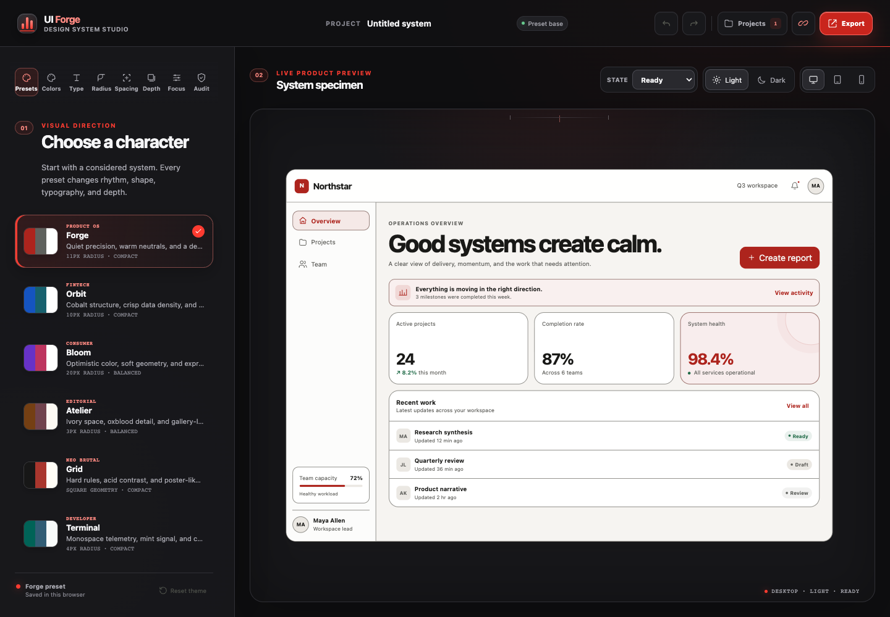
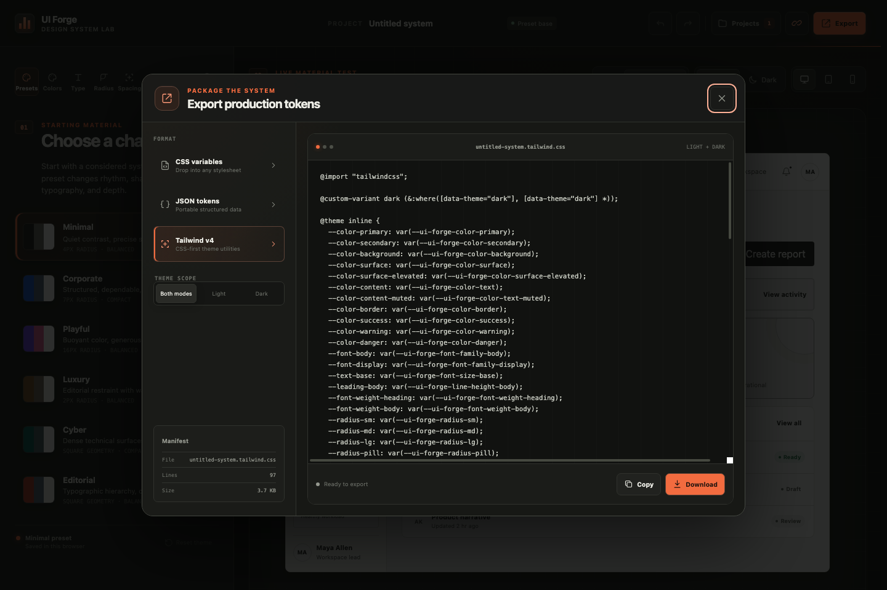
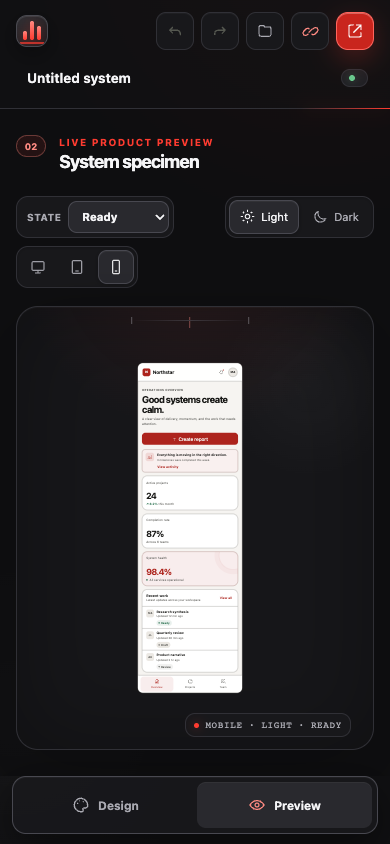

# UI Forge

[](https://github.com/Angel-Guiberteau/UI---Forge/actions/workflows/deploy-pages.yml)

UI Forge is an interactive design-system laboratory for shaping visual tokens and testing them against a complete product interface in real time.

**Live demo:** [angel-guiberteau.github.io/UI---Forge](https://angel-guiberteau.github.io/UI---Forge/)

The project is built as a portfolio-grade frontend product rather than a collection of disconnected component examples. Every change is evaluated inside Northstar, a fictional operations application with navigation, dashboards, tables, forms, dialogs, feedback, and deliberately varied UI states.

## Objective

Demonstrate product design, React architecture, TypeScript, complex client state, responsive interface design, accessibility analysis, persistence, and developer handoff workflows in one cohesive tool.

## Screenshots

| Workspace | Tailwind handoff | Mobile preview |
| --- | --- | --- |
|  |  |  |

## Features

- Live editing for colors, typography, radius, spacing, shadows, and controls.
- Six distinct presets: Minimal, Corporate, Playful, Luxury, Cyber, and Editorial.
- Independent light and dark themes with instant mode switching.
- Complete interactive preview application with desktop, tablet, and mobile frames.
- Loading, empty, error, success, modal, dropdown, table, and form states.
- WCAG contrast audit for text and interface combinations.
- Undo and redo history for theme changes.
- Versioned local project library with duplicate, archive, and restore flows.
- Self-contained share links with safe validation and explicit local import.
- CSS variables, structured JSON, and Tailwind v4 CSS-first exports.
- Clipboard and downloadable-file handoff workflows.
- Keyboard-accessible dialogs, visible focus states, scroll locking, and reduced-motion support.

## Stack

- React 19
- TypeScript 6
- Vite 8
- Native CSS with semantic design tokens and nesting
- Vitest and Testing Library
- Browser Local Storage

No component library or animation dependency is used. The visual system and interactions are implemented specifically for UI Forge.

## Architecture

```text
src/
├── app/                 Application composition and integration tests
├── components/          Editor, preview, project, export, and share interfaces
├── features/            Theme domain, storage, accessibility, export, and sharing logic
├── hooks/               Reusable interaction behavior
├── presets/             Curated light and dark theme foundations
└── styles/              Scoped application and component styles
```

The theme reducer is the source of truth for the active project, history, viewport, and editor section. Pure feature modules handle contrast calculations, serialization, export generation, storage migration, and shared-link validation. Components remain focused on presentation and interaction.

Projects are stored locally in a versioned workspace envelope. Existing single-project data is migrated automatically, and imported links always create a new project instead of replacing local work.

## Installation

Requirements:

- Node.js 20.19 or newer, or Node.js 22.12 or newer
- npm 10 or newer

```bash
git clone <repository-url>
cd UIForge
npm install
npm run dev
```

Vite will print the local URL used to open the application.

## Environment variables

No environment variables are required. UI Forge has no external API, account provider, or server-side secret in its current frontend-first release.

## Demo data

The initial Minimal system and the complete Northstar specimen are generated in the browser. Presets, realistic dashboard content, projects, activity, notifications, and alternate application states are available immediately after installation.

Browser data can be reset by clearing Local Storage for the application origin.

## Testing

```bash
npm run lint
npm run test
npm run build
npm run build:pages
```

The test suite prioritizes theme history, project persistence and migration, accessibility calculations, export formats, shared-link validation, dialogs, keyboard focus, and important specimen interactions.

## Deployment

The repository includes a GitHub Pages workflow that runs linting, the complete test suite, and a production build before publishing. It uses `/UI---Forge/` as the production base while keeping local development at `/`.

GitHub Pages publishes automatically after every push to `main`. To configure the repository from scratch:

1. Open the repository settings on GitHub.
2. In **Pages**, select **GitHub Actions** as the build source.
3. Push `main`, or run the deployment workflow manually from the **Actions** tab.

The production artifact includes the branded 404 page, sitemap, robots file, social image, manifest, and hashed assets. The full product rationale is documented in [the case study](docs/CASE_STUDY.md).

## Technical decisions

- Theme changes are modeled as immutable reducer transitions so history and project switching stay predictable.
- Share links contain a versioned snapshot but never expose local project identifiers or browser history.
- Tailwind export targets the CSS-first theme-variable workflow and preserves semantic light/dark tokens without requiring a generated JavaScript config.
- Native CSS keeps the design language distinctive and avoids shipping a UI framework solely for basic primitives.
- The application remains fully demonstrable without paid services, accounts, or network access.

## Project status

Public release. The frontend product, developer handoff, recovery states, deployment workflow, portfolio case study, and public demo are complete.

## Author

Ángel Dev — design and development.
